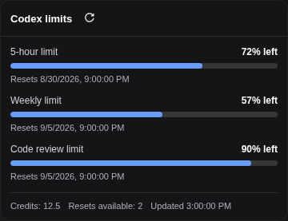

# DeepSeek Harness — OpenAI Codex Plugin

Use a **ChatGPT Plus or Pro** subscription as an LLM provider in [DeepSeek Harness](https://github.com/deepseek-ai/deepseek-harness).

The plugin adds device-code OAuth login through the Web settings UI and an interactive Harness `/codex` slash command. It does not run a browser callback server or localhost listener. After login, Codex models appear with other providers, tokens refresh automatically, and Web shows 5-hour and weekly limits in a **Codex limits** popup.

<p align="center">
  
</p>

<p align="center"><sub>Rendered by the real plugin UI with sanitized demonstration balances.</sub></p>

> The limits view and the live model-catalog sync use OpenAI's undocumented Codex endpoints. Their availability and response shape may change without notice.

## Requirements

- A ChatGPT Plus or Pro subscription with Codex access.
- DeepSeek Harness `0.1.0-rc.6` or a compatible release.
- Node.js 18 or newer.
- pnpm available to the `dsh plugin` command.
- Outbound HTTPS access to `auth.openai.com` and `chatgpt.com`.

## Install

DSH reconciles plugins per profile. Install the package in every profile where the provider or `/codex` command is needed; `web` is shown here:

```bash
dsh plugin --profile web add -w @syncended/dsh-codex
```

For local development, install a checkout instead:

```bash
dsh plugin --profile web add -w /absolute/path/to/deepseek-harness-openai-codex
```

The package declares a DSH bundle. It registers the `openai-codex` route and maps its credential automatically, so no `dsh settings set` command is needed. Restart the selected profile after installing or upgrading.

To remove it:

```bash
dsh plugin --profile web remove @syncended/dsh-codex
```

## Connect a ChatGPT account

### Web GUI

1. Open **Settings → OpenAI Codex**.
2. Click **Sign in**. The plugin opens OpenAI's device-login page in another tab.
3. Return to DSH, copy the one-time code displayed there, and paste it into the OpenAI page.
4. Approve access and return to DSH. The settings page updates to **Connected** automatically.
5. Choose an `openai-codex/...` model from the standard model selector and send a test prompt.
6. Use **Codex limits** above Settings to inspect the normalized 5-hour and weekly balances.

Like other DSH credential settings, Web login is restricted to a loopback/same-origin Host session. For a remote Host, use an authenticated SSH/local tunnel to its loopback Web UI rather than exposing credential operations publicly.

### Interactive Harness command

`/codex` is a Harness slash command, not a shell executable. Run it inside an interactive profile that has this plugin installed:

| Command | Description |
| --- | --- |
| `/codex login` | Start the device-code flow and print the verification URL and code. |
| `/codex status` | Show token status and expiry. |
| `/codex models` | Re-read OpenAI's Codex model catalog and republish it to the model selector. |
| `/codex logout` | Delete the stored token file and unpublish the live credential. |

## How it works

1. The plugin stores `{ access, refresh, expires }` in `$DSH_HOME/openai-codex.json` by default.
2. It publishes only the live access token to the DSH credential service as `OPENAI_CODEX_TOKEN`.
3. The bundled `llm-pi-ai` route uses the `openai-codex-responses` API and serves the installed pi-ai Codex catalog directly. It declares no `models` list: in `dsh-llm-pi-ai` a configured list *replaces* the catalog rather than extending it, so a hard-coded list would freeze model availability at this package's release.
4. The plugin then mirrors OpenAI's own Codex model catalog into the `llm-pi-ai` settings section, because the installed pi-ai catalog is a snapshot that lags what ChatGPT actually serves. New models (for example `gpt-6-sol` before pi-ai shipped it) appear as soon as OpenAI lists them; models OpenAI hides, models it marks as superseded through `upgrade.model`, and ids in `modelCatalogExclude` are dropped. The sync runs at startup, after login, on `/codex models`, and every `modelCatalogRefreshMs`.
5. The refresh loop renews credentials shortly before expiry without requiring a Host restart.
6. The Web limits API calls OpenAI from the Host and returns only normalized percentages, reset times, and optional credit balances; OAuth tokens never cross into browser JavaScript.

Protect `$DSH_HOME`: the token file is sensitive local credential state. `/codex logout` removes it and clears the published credential.

## Configuration

The defaults normally need no changes. To override them, edit the existing `openai-codex` row in `$DSH_HOME/profiles/<profile>/cordis.patch.yml` and restart that profile:

```yaml
- id: openai-codex
  config:
    # clientId: app_EMoamEEZ…hrann
    credentialRef: OPENAI_CODEX_TOKEN
    deviceCodeTimeoutSeconds: 900
    refreshWindowMs: 300000
    modelCatalogRefreshMs: 21600000
    modelCatalogExclude:
      - gpt-6-astra
    # dshHome: /absolute/path/to/dsh-home
    # tokenFile: /absolute/private/path/openai-codex.json
```

| Key | Default | Description |
| --- | --- | --- |
| `clientId` | built in | OpenAI OAuth client ID used by the device flow. |
| `credentialRef` | `OPENAI_CODEX_TOKEN` | DSH credential ref receiving the live access token. |
| `deviceCodeTimeoutSeconds` | `900` | Maximum time to approve a device login. |
| `refreshWindowMs` | `300000` | Refresh-loop scheduling window; the implementation still refreshes only near expiry. |
| `modelCatalogRefreshMs` | `21600000` | Interval between Codex model-catalog syncs (6 hours). |
| `modelCatalogExclude` | `[gpt-6-astra]` | Model ids to hide from the synced catalog even though OpenAI still lists them. Set `[]` to offer everything the catalog lists. |
| `dshHome` | normal DSH home | Alternate base directory used to derive the default token path. |
| `tokenFile` | `$DSH_HOME/openai-codex.json` | Absolute token persistence path; takes precedence over `dshHome`. |

Token-path precedence is `tokenFile`, then `dshHome`, then `DSH_HOME`, then `~/.dsh`.

### Model list

Two sources feed the selector, in this order:

1. The bundle declares no `models` list, so the route serves the whole Codex catalog installed with `pi-ai`.
2. The plugin overwrites `models` in the `llm-pi-ai` settings section with the live list from OpenAI's own Codex model catalog (`/backend-api/codex/models`). This is what makes models appear that `pi-ai` has not shipped yet. The write lands in `$DSH_HOME/settings.yaml`, so the last synced list survives a Host restart and a temporarily unreachable backend.

A `models` list replaces the catalog instead of extending it, which is why the plugin writes the complete live list rather than individual entries. To pin a subset by hand, edit the `openai-codex` provider in `settings.yaml`; the next scheduled sync will overwrite it again, so set `modelCatalogRefreshMs` to a large value if a manual list must stand.

```yaml
llm-pi-ai:
  providers:
    openai-codex:
      models:
        - id: gpt-6-sol
        - id: gpt-6-luna
```

The sync serves only the models this deployment should offer:

- rows the catalog hides (`visibility: hide`) or excludes from the API (`supported_in_api: false`) — `gpt-reserve`, `codex-auto-review`;
- rows the catalog marks as superseded: their `upgrade.model` names another listable model. When `gpt-6-sol` landed, `gpt-5.6-sol`, `gpt-5.6-terra`, and `gpt-5.5` (which retires 2026-10-14) disappeared from the selector without any configuration;
- ids listed in `modelCatalogExclude`. OpenAI still lists `gpt-6-astra` after `gpt-6-sol`/`gpt-6-luna` shipped and gives it no `upgrade` marker, so the bundle hides it explicitly; set `modelCatalogExclude: []` to offer it again.

Models the catalog describes keep their context window, token cap, modalities, and reasoning levels; a synced entry overrides only the fields it sets. Reasoning levels the harness does not know (for example `ultra`) are dropped rather than mistranslated.

Models that `pi-ai` does not describe (for example `gpt-6-sol`) are declared without the catalog's `compat` flags, because `dsh-llm-pi-ai` only offers those to catalog rows. Basic requests work; the optional grammar-tool and tool-search switches stay off until `pi-ai` ships the model.

If `credentialRef` is changed, update the matching provider mapping in the existing `llm-pi-ai` row as well; otherwise the route continues reading `OPENAI_CODEX_TOKEN`:

```yaml
- id: llm-pi-ai
  config:
    providers:
      openai-codex:
        displayName: OpenAI Codex
        apiKeyEnv: MY_CODEX_TOKEN_REF
```

## Troubleshooting

- **No Codex models:** confirm the plugin is installed in the active profile, restart that profile, and verify `/codex status` reports a credential. If only some Codex models show, a hand-pinned `models` list is shadowing the synced one.
- **A new Codex model is missing:** run `/codex models` to re-read OpenAI's catalog, then check the Host log if the sync failed. A model whose `minimal_client_version` is newer than the plugin's `CODEX_CLIENT_VERSION` stays hidden until the plugin is updated.
- **A model disappeared after a sync:** the catalog marks it superseded (`upgrade.model` naming a served model), or its id is in `modelCatalogExclude`. Remove the id from the exclude list or pin a manual `models` list to keep it.
- **Login never completes:** confirm outbound access to OpenAI endpoints, repeat `/codex login`, and approve before the 15-minute timeout.
- **Remote Web login is rejected:** connect through loopback using an authenticated tunnel; credential mutation is intentionally restricted.
- **Limits fail but models work:** the undocumented usage endpoint may have changed or be unavailable; model requests use a separate API path.
- **Model catalog sync fails:** `/backend-api/codex/models` is undocumented and may change; the last synced list stays in `$DSH_HOME/settings.yaml`, so the selector keeps working until a later sync succeeds.
- **Repeated sign-in after configuration changes:** verify the token path is writable and `credentialRef` matches the `llm-pi-ai` provider mapping.

## Development

```bash
npm test
npm pack --dry-run
```

Tag-driven publication is documented in [`RELEASING.md`](./RELEASING.md).

## License

MIT — see [`LICENSE`](./LICENSE).
